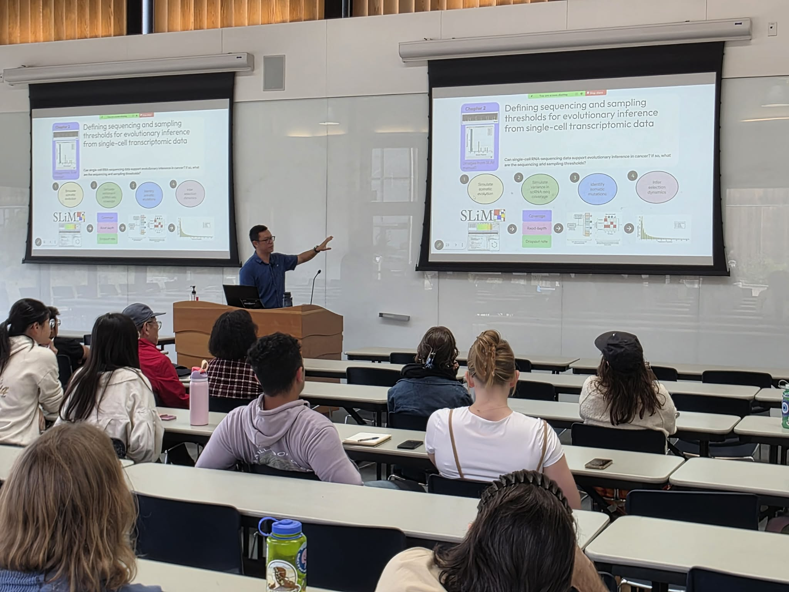
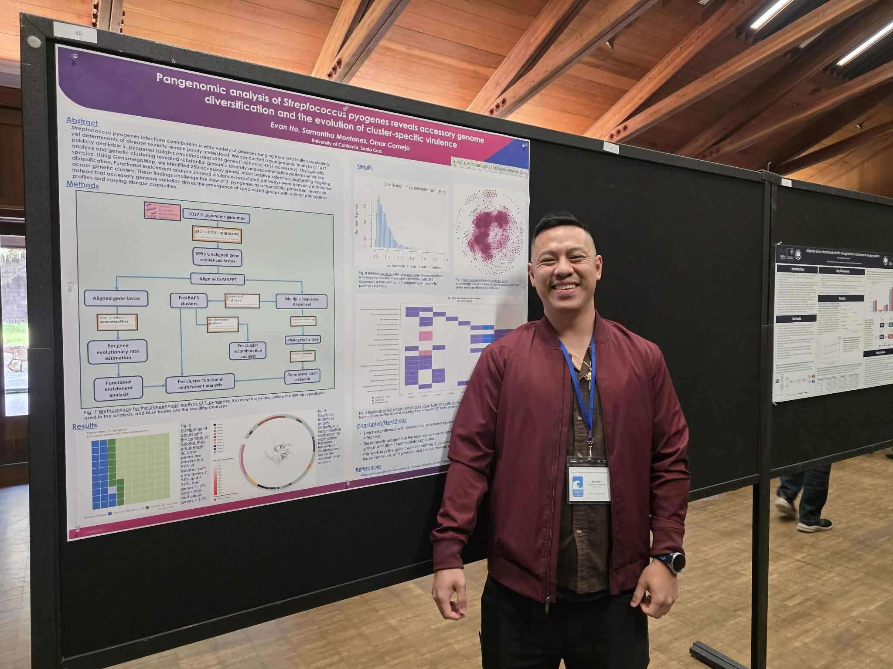
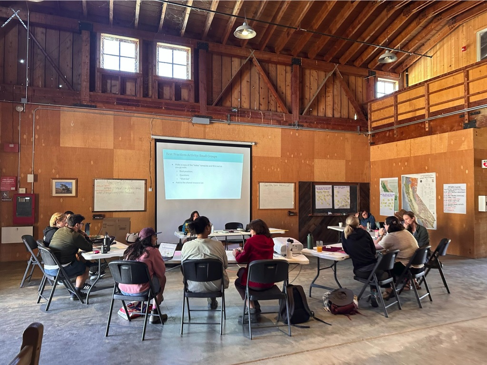

## Research Interests

#### How does genomic variation shape disease onset and progression?

I'm a PhD candidate at UC Santa Cruz in the Cornejo Lab using population genomics 
and computational biology to answer that question, from the pangenome of bacterial 
pathogens to the evolutionary dynamics of cancer.

## Updates

---

**June 2026 — Population, Evolutionary, and Quantitative Genetics (PEQG) 2026**

{width="100%"}

I attended PEQG back in 2023 as a Master's student, and what an immense privilege
to be able to present my *Streptococcus pyogenes* work this year as a PhD candidate!
This project is nearing completion and I was excited to present newer updated results.
I am currently solidifying ideas for the next two chapters of my PhD on cancer 
evolution, and attending PEQG was pivotal for shaping my thinking and networking
with potential collaborators.

---

**May 2026 — Became a PhD Candidate!**

{width="100%"}

I passed my qualifying exam and officially became a PhD Candidate! I have immense
gratitude for my qualifying exam committee members Dr. Angela Brooks, Dr. Alice
Berger, Dr. Giacomo Bernardi, and Dr. Omar Cornejo. It was also the first time 
that I presented science in front of my family, which was important to me as a 
first generation college graduate of Taiwanese immigrants and the first in my 
family to pursue a PhD. Very excited to dive into the research!

---

**January 2026 — 64th Midwinter Conference of Immunologists**

{width="100%"}

My first time at the Midwinter Conference of Immunologists at Asilomar, CA, where 
I presented a poster on pangenomic analysis of *Streptococcus pyogenes* and accessory 
genome diversification. It was fascinating to learn so much about new advances and
discoveries in human immunology, many of which uses cutting edge data single-cell
sequencing data. I was left motivated, inspired, and humbled by the impressive
science on display.

---

**November 2025 — Queer & Trans Field Safety Assessment preprint now on EcoEvoRxiv!**

{width="100%"}

What stands between best practices for LGBTQIA+ field safety and their actual 
implementation? That's the question a team of 15 researchers across the University 
of California set out to answer. Together we developed the Queer and Trans Field 
Safety Assessment: a structured, example-based tool designed to help field teams, 
courses, and research labs build genuinely inclusive environments before, during, 
and after fieldwork. I'm immensely proud to share that our preprint is now available 
on EcoEvoRxiv, with publication forthcoming in the *Bulletin of the Ecological 
Society of America* in 2026!

