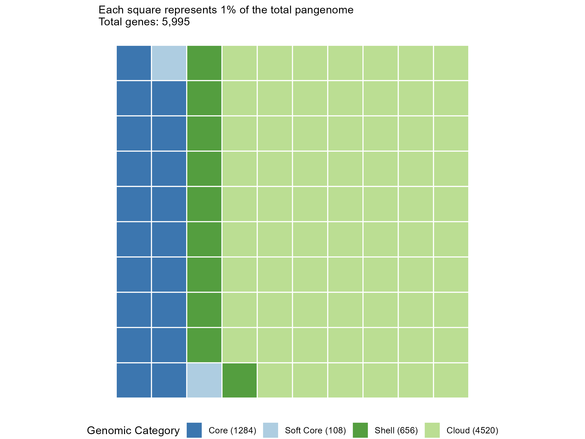
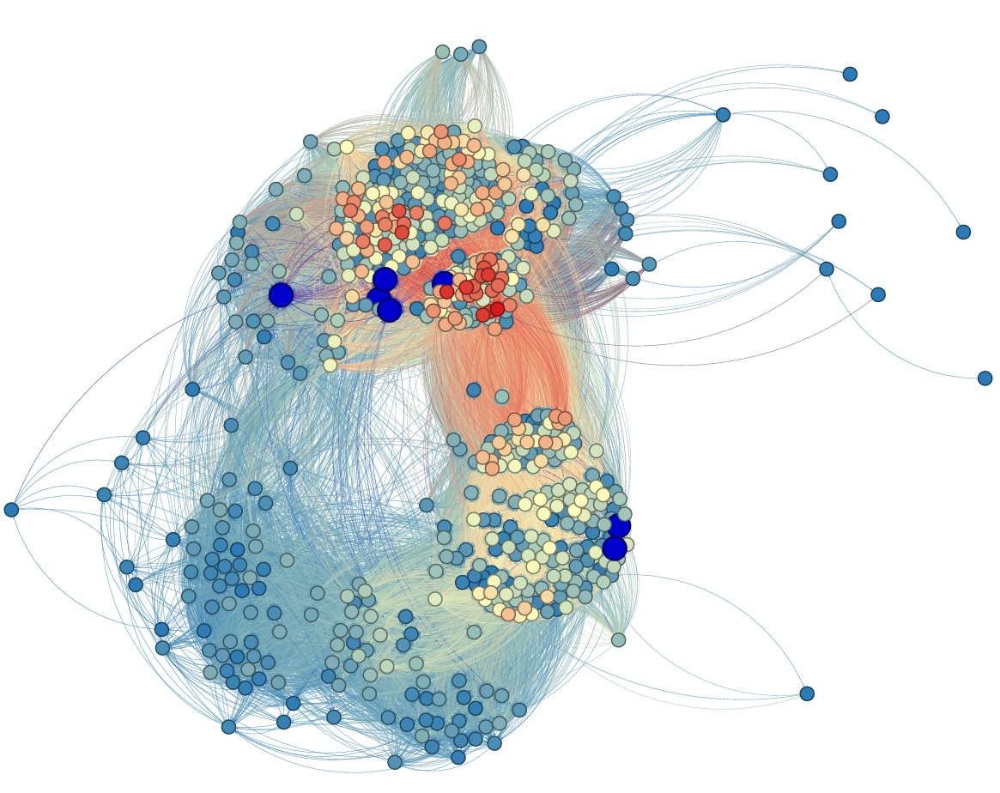
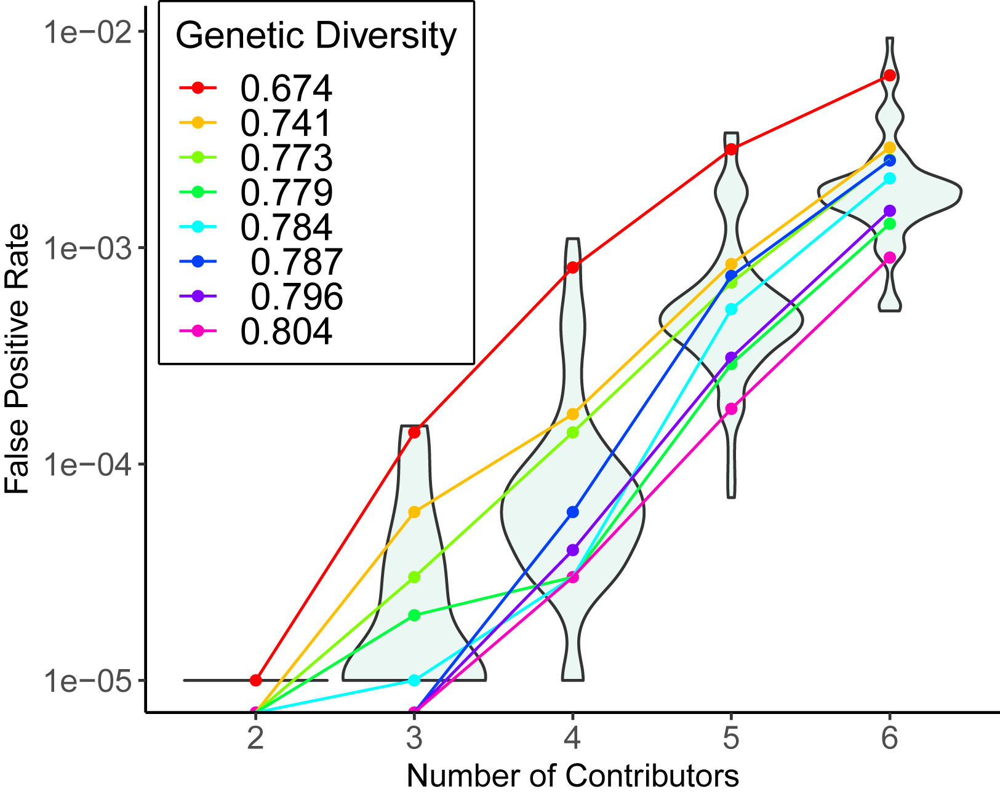
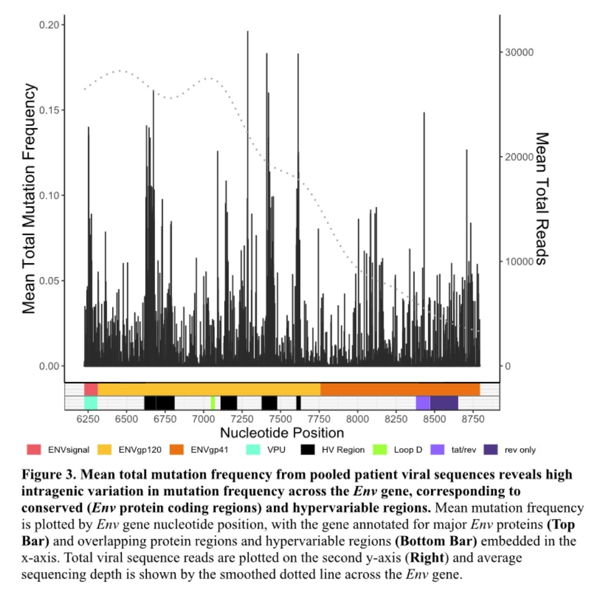

# Ongoing Research

## *Streptococcus pyogenes* Pangenome Investigation

Currently, I am investigating the pangenome of *Streptococcus pyogenes* (*S. pyogenes*), a bacterial pathogenic species infamously known for causing strep throat in humans. I use computational and bioinformatic approaches to explore how genomic variation across over a thousand isolates shapes the evolutionary and functional landscape of this organism, with a particular focus on how that relates to its virulence capacity.

Figure 1: Distribution of genes across isolates. Genes present in ≥ 99% of isolates are defined as core, ≥ 95% and \< 99% as soft core, ≥ 15% and \< 95% as shell, and \< 15% as cloud genes. All rights reserved; please do not reproduce or use without permission.

Figure 2: Gephi visualization of significant gene associations. Nodes are genes while edges are significant associations between genes. Known virulence genes are highlighted in darker blue and their nodes made slightly larger. All rights reserved; please do not reproduce or use without permission.

## Pediatric Autoimmune Neuropsychiatric Disorder Associated with Streptococcal Infections

After a strep infection, some pediatric patients develop post-infection complications in the form of neuropsychiatric disorders. One of the primary motivations for the *S. pyogenes* pangenome investigation is to establish a genomic and immunological connection between a strep infection and Pediatric Autoimmune Neuropsychiatric Disorder Associated with Streptococcal infections (PANDAS).

Some current gaps in knowledge are:

- What genetic factors in *S. pyogenes* trigger this post-infection complication?
- Can all strains of *S. pyogenes* trigger PANDAS, or only a subset?
- What are the bacterial peptides that trigger flares in patients presenting with disease?

To address these gaps in knowledge, I am analyzing antibody epitope repertoires of pediatric PANS patients with a focus on antigens found in *S. pyogenes*. This project will compare control to PANDAS flare cohorts to identify and validate *S. pyogenes* associated epitopes that are enriched during disease states

## Within-patient Cancer Evolution

After the *S. pyogenes* projects, I will be starting a new project that focuses on inferring evolutionary dynamics in somatic evolution using single-cell sequencing data. More on this coming soon!

# Previous Research

## Forensic Genetics

Is a DNA forensic technique less accurate for some human population groups? During my Master's at San Francisco State University, I investigated the accuracy of DNA mixture analysis using Forensim, a free and open source R package, to simulate and evaluate DNA mixtures based on allele frequency distributions from diverse groups. Using this approach, our group (led by Dr. Rori Rohlfs) quantified the accuracy, including both false positive rate and power, of DNA mixture analysis across human genetic groups, including cases involving mis-specified reference groups. Check out our paper [here](<https://www.cell.com/iscience/fulltext/S2589-0042(24)02292-2>).

## Within-patient Viral Evolution

How does HIV evolve within and across patients? Also during my Master's, I joined Dr. Pleuni Pennings' lab and worked closely with Dr. Sarah Renee Phillips to investigate how a specific gene in HIV was evolving within patients. We analyzed how the gene accumulated mutations over time and tracked various mutation types, such as transition versus transversion rates, CpG sites, and synonymous versus nonsynonymous mutations, among others. This project motivated me to pursue research in disease evolution through the analysis of genomic data!

## Protecting Queer and Trans Field Scientists

What stands between best practices for LGBTQIA+ field safety and their actual implementation? That's the question a team of 15 researchers across the University of California set out to answer. Together we developed the Queer and Trans Field Safety Assessment: a structured, example-based tool designed to help field teams, courses, and research labs build genuinely inclusive environments before, during, and after fieldwork. I'm immensely proud to share that our preprint is now available on [EcoEvoRxiv](<https://ecoevorxiv.org/repository/view/10751/>), with publication forthcoming in the *Bulletin of the Ecological Society of America* in 2026!
