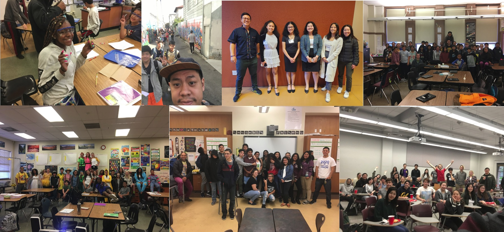

Teaching and mentorship is a critical part of my identity. I earned my secondary teaching credential simultaneously with my bachelor's degree through the University of California, Berkeley's CalTeach program. In my teaching, I prioritize making science accessible and engaging, particularly for students from backgrounds that have traditionally been marginalized in STEM.

# Current Mentees

- Sara Teitelbaum: UC Santa Cruz, Pediatric Autoimmune Neuropsychiatric Disorder associated with Streptococcal Infections (PANDAS) project

# Past Mentees

- Samantha Montanez: Fall 2024 to Summer 2025, UC Santa Cruz, Pangenomic Investigation of *Streptococcus pyogenes*
- Hse Zar Yi: Summer 2023, NexGeneGirls, Analysis of *E. coli's* resistance to Gentamicin using machine learning algorithms
- Breanna Durant: Summer 2023, NexGeneGirls, A Machine Learning Approach to Predict the Antibiotic Resistance of *E. coli* to Cefuroxime
- Joi Johnson: Summer 2023, NexGeneGirls, *E. coli* resistance to AmoxiClav using machine learning models

# Previous Teaching Experiences

- NexGeneGirls Program: Summer 2023, San Francisco, CA
- Summer Coding Immersion Program (SCIP): Summer 2021 to 2022, San Francisco State University, San Francisco, CA
- 8th Grade Science Teacher: 2017 to 2021, Willard Middle School, Berkeley, CA
- Undergraduate Instructor, DeCal Program: 2014 to 2017, University of California, Berkeley, Berkeley, CA

# Teaching Assistant Positions at the University of California, Santa Cruz

- Genetics
- Population Genetics
- Evolution
- Evolutionary Medicine
- Ecology and Evolution

{width="100%"}
